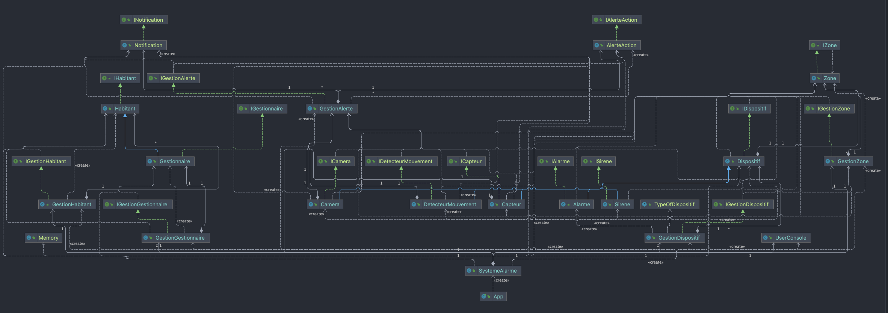
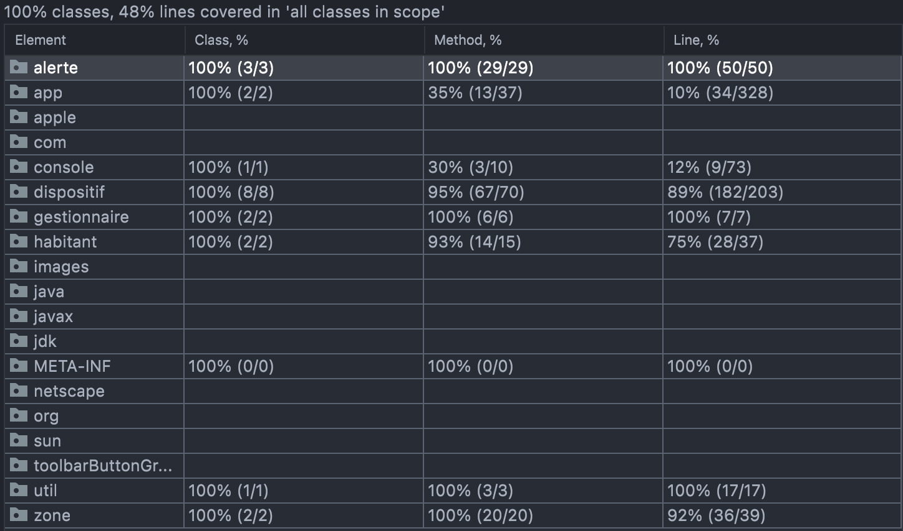

# CPOO - TD02

## Enoncé

1. Le système d'alarme ne peut avoir qu'un seul client gestionnaire. Par défaut son nom est "Client" et son mot de passe
   est "1234".
2. Le client gestionnaire peut ajouter et effacer des "habitants" au système. Par défaut il est déjà un habitant.
3. Le client gestionnaire peut renoncer à ses droits de gestionnaire (et redevenir un habitant normal) en spécifiant le
   nom du nouveau client gestionnaire.
4. Le client gestionnaire peut spécifier que l'appartement est composée de zones (typiquement des pièces).
5. Chaque zone a un nom, et une courte description.
6. Une zone peut contenir d'autres zones (typiquement dans une maison sur plusieurs étages, le client peut décider de
   créer une zone par étage, et chaque étage a des zones qui sont les pièces de l'étage)
7. Chaque dispositif du système d'alarme doit être associée à une zone
8. Le client gestionnaire doit pouvoir associer/modifier l'association d'un dispositif à une zone
9. Le client gestionnaire doit pouvoir effacer une zone
10. Le client pouvoir doit pouvoir connaître tous les dispositifs dans une zone donnée et pouvoir activer/désactiver (en
    groupe) les dispositifs d'une zone donnée.
11. Chaque dispositif, lorsqu'il est déclenché (cela en concerne pas les sirènes mais seulement les dispositifs qui
    décèlent une intrusion) doit envoyer un message de déclenchement à la centrale d'alarme qui déclenche des actions d'
    alerte
12. Les actions d'alerte (éditable par le client gestionnaire) peuvent être l'allumage des sirènes, l'envoi de sms aux
    numéros renseignés dans le système, l'enregistrement des images des caméras, etc...

## Scénarios

- Création des habitants
- Création des zones
- Gestion des dispositifs

## Persistance

Grâce au fichier ```sauvegarde.txt```

## UML Diagramme du programme

Le diagramme UML est à peu près le même que celui produit dans GenMyModel avec le reste de la classe. J'ai modifié
certaines parties au fur et à mesure de l'implémentation.



## Run

Pour utiliser le programme, il y a deux choix :

- Build le programme via le compilateur de Eclipse / Intellij IDEA
- Créer une configuration et lancer le fichier ```artifacts/TD2_jar/TD2.jar```
    - Sous Intellij
      IDEA https://www.jetbrains.com/help/idea/creating-and-running-your-first-java-application.html#create_jar_run_config
    - Sous Eclipse https://newbedev.com/how-to-run-a-jar-file-in-eclipse

## Test

### Code coverage



### Lancer les tests

Pour tester le projet, il faut s'assurer de mettre la variable
```isTesting = true``` dans la classe SystemeAlarme. Cela permet de passer outre le système d'authentification de l'app.
Etant donné que je n'ai pas réussi à tester les inputs de l'utilisateur, je n'ai pas eu d'autre choix que de faire un
système pour passer outre.

## Documentation JavaDoc

La documentation est disponible dans le dossier ```doc/```, il est possible d'ouvrir le fichier ```index.html``` pour
avoir une documentation dans le navigateur.

## Auteur

- Vasseur Pierre-Adrien

